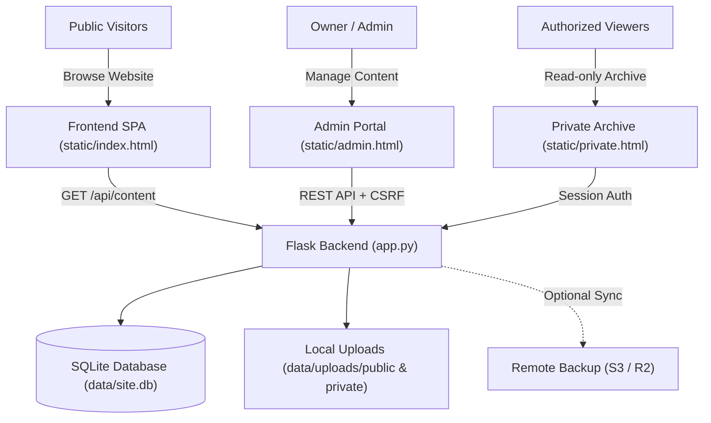

# Burhanuddin Malik — Portfolio & Content Management System

A content-managed personal portfolio website and admin portal built for **Burhanuddin Malik**. Every section of the public website is dynamically connected to a persistent backend database and can be edited directly from the Admin Portal without modifying code.

---

## 1. System Architecture



### Technology Stack
* **Frontend**: Vanilla JavaScript Single Page Application (SPA), semantic HTML5, modern CSS3 with custom properties and theme engine (Royal Night, Emerald, Minimal, Classic, Modern Blue). Zero external heavy frameworks, lightweight, fast, responsive.
* **Backend**: Python Flask REST API (`app.py`), running on WSGI/HTTP server with session-based authentication, PBKDF2 SHA-256 password hashing, HMAC-secured CSRF tokens, and rate limiting.
* **Database**: Persistent SQLite (`data/site.db`) configured with Write-Ahead Logging (`WAL` mode) and foreign keys for high reliability and concurrency.
* **File & Media Storage**: Segregated local storage in `data/uploads/public` (public assets) and `data/uploads/private` (permission-restricted assets), with optional automated S3 / Cloudflare R2 backup syncing.

---

## 2. Dynamic Content Flow: Admin → Website

The public website does not depend on hardcoded content. Content is served through the `/api/content` endpoint and updated via the Admin Portal:

| Section | Admin Management | Public Route | Features |
| :--- | :--- | :--- | :--- |
| **Home Page** | `#/home` | `/` | Hero badge, titles, narrative paragraphs, CTA buttons, featured work section, quote banners, contact headers. |
| **About Page** | `#/about` | `/about` | Biography headline, narrative story, identity pillars, growth milestones, education path, learning items. |
| **Projects / Work** | `#/list/project` | `/work`, `/work/<slug>` | Full case studies: Hero, Overview, Story, Process, Timeline, Techniques, Challenges, Result, Learned, Gallery, Related Work. Position reordering. |
| **Visual Gallery** | `#/list/gallery` | `/work/gallery` | Artwork titles, categories, high-resolution imagery, lightbox viewer, linked project case studies. |
| **Journey** | `#/list/journey` | `/journey` | Chronological chapters, period markers, summaries, full narrative stories, key takeaways, anchor links. |
| **Achievements** | `#/list/achievement` | `/achievements` | Category filters (Artistic, Sports, Leadership, Certifications, Presentations, Recognition), descriptions, certificates, and recognition notes. |
| **Blog Articles** | `#/list/post` | `/blog`, `/blog/<slug>` | Markdown rich-text editor, categories, publish dates, excerpts, cover photos, tags, related project links. |
| **Contact & Socials** | `#/contact` | `/contact` | Email, WhatsApp, Instagram, LinkedIn, GitHub, Twitter, and custom contact prompts. |
| **Themes** | `#/themes` | Global selector | Active theme choices and default theme selection. |
| **Media Library** | `#/media` | Global picker | Central asset repository, drag-and-drop upload, usage tracking, metadata editing (title, caption, alt text). |
| **Private Archive** | `#/list/<kind>` | `/private` | Role-based private entries (Full Details, Special Achievements, Private Artwork, Reflections, Journals, Documents). |

---

## 3. Database Schema & Models

The SQLite database (`data/site.db`) contains the following tables:

* **`users`**: User accounts (Admin owner and Level A/B/C viewers).
  * Columns: `id`, `username`, `name`, `email`, `role`, `pw` (hash), `sections` (JSON array), `active`, `created`, `updated`, `last_login`.
* **`items`**: Unified content repository for all portfolio, blog, journey, achievement, and private archive entries.
  * Columns: `id`, `kind` (`project`, `gallery`, `journey`, `achievement`, `post`, `detail`, `special`, `artwork`, etc.), `slug`, `title`, `data` (JSON document containing all structured fields), `status` (`published`, `draft`, `unpublished`), `access` (`A`, `B`, `C`, `O`), `pos` (integer sort order), `created`, `updated`.
* **`media`**: Central media library indexing all uploaded images and documents.
  * Columns: `id`, `name`, `original_name`, `ext`, `size`, `is_private`, `title`, `caption`, `alt`, `project`, `pos`, `created`.
* **`hits`**: Privacy-friendly aggregate visitor analytics.
  * Columns: `id`, `ts`, `day`, `vid` (anonymous visitor token), `path`, `kind`, `slug`, `src` (referrer source), `device` (Desktop/Mobile/Tablet), `secs` (time on page), `sid` (session ID).
* **`feedback`**: Anonymous visitor ratings and impressions.
  * Columns: `id`, `ts`, `design`, `content`, `navigation`, `overall`, `comment`.
* **`contacts`**: Inquiries sent through the contact form.
  * Columns: `id`, `ts`, `name`, `email`, `message`, `read`.
* **`passcodes`**: Shared access passcodes for group archive access.
  * Columns: `id`, `label`, `role` (`A`, `B`, `C`), `pw` (hash), `sections` (JSON array), `active`, `ver`, `created`, `last_used`, `uses`.
* **`activity`**: Administrative audit trail for all content modifications and security events.
  * Columns: `id`, `ts`, `actor`, `action`, `obj`, `area`.
* **`settings`**: Key-value store for site-wide configuration.
  * Columns: `k` (primary key), `v` (JSON or string value).
* **`backups`**: Automated daily and weekly site archive snapshots.
  * Columns: `id`, `ts`, `name`, `kind`, `size`, `status`, `note`.

---

## 4. Authentication, Authorization & Security

1. **Password Security**: Passwords are never stored in plaintext. Passwords use PBKDF2 with SHA-256 and unique salt via `werkzeug.security`.
2. **Session Protection**:
   * HTTP-only session cookies with configurable `SameSite` and `Secure` attributes (`HTTPS=1`).
   * Permanent sessions expire automatically after 7 days for users, 72 hours for shared passcodes.
3. **CSRF Protection**: All mutating operations (`POST`, `PUT`, `DELETE`, `PATCH`) require a cryptographic CSRF token passed via the `X-CSRF` header.
4. **Rate Limiting**:
   * Sign-in attempts: Maximum 6 attempts per 15-minute window per IP.
   * Contact messages & feedback: Maximum 5 submissions per hour per IP.
5. **Role-Based Access Control (RBAC)**:
   * **Owner (Rank 99)**: Full access to the Admin Portal, settings, content creation, and private archives. Can preview the archive as Level A, B, or C.
   * **Level A (Rank 3)**: Access to Level A, B, and C private archive entries.
   * **Level B (Rank 2)**: Access to Level B and C private archive entries.
   * **Level C (Rank 1)**: Access only to Level C private archive entries.
   * **Unauthenticated Visitors**: Zero access to private entries or private media files.
6. **Server-Side File Authorization**:
   * Private files (`/api/private/file/<name>`) verify the visitor's authentication and role rank on every single request. Direct URL access without proper permissions returns HTTP 401 or 404.
   * Safe filenames are generated with 32-character hexadecimal hashes (`NAME_RE`), preventing path traversal attacks.

---

## 5. Local Setup & Running Instructions

### Prerequisites
* Python 3.10+ (recommended: Python 3.12 or 3.14)
* Git

### Step-by-Step Setup

1. **Clone the repository**:
   ```bash
   git clone https://github.com/malikeffect53/portfolio.git
   cd portfolio
   ```

2. **Configure environment variables**:
   Copy `.env.example` to `.env` (or set environment variables in your terminal):
   ```bash
   # Linux / macOS
   export OWNER_PASSWORD="your-admin-password"
   export PORT=8080

   # Windows PowerShell
   $env:OWNER_PASSWORD="your-admin-password"
   $env:PORT="8080"
   ```

3. **Install dependencies**:
   ```bash
   pip install -r requirements.txt
   ```

4. **Start the development server**:
   ```bash
   python app.py
   ```

5. **Open in browser**:
   * **Public Website**: [http://localhost:8080/](http://localhost:8080/)
   * **Admin Portal**: [http://localhost:8080/admin](http://localhost:8080/admin) (Sign in with username: `owner`, password: `your-admin-password`)
   * **Private Archive**: [http://localhost:8080/private](http://localhost:8080/private)

---

## 6. Environment Variables

| Variable | Default | Purpose |
| :--- | :--- | :--- |
| `OWNER_PASSWORD` | *(auto-generated)* | Initial password for the `owner` account. |
| `PORT` | `8080` | Web server listening port. |
| `SECRET_KEY` | *(auto-generated)* | Secret key for Flask sessions and CSRF tokens. |
| `HTTPS` | `0` | Set to `1` in production to enforce `Secure` cookies. |
| `DATA_DIR` | `data` | Directory where database, uploads, and backups are stored. |
| `NO_SCHEDULER` | `0` | Set to `1` to disable background backup scheduler. |
| `BACKUP_S3_BUCKET` | *(none)* | S3 bucket name for off-site backup synchronization. |
| `BACKUP_S3_ENDPOINT`| *(none)* | Custom S3 endpoint URL (Cloudflare R2, Backblaze B2). |
| `AWS_ACCESS_KEY_ID` | *(none)* | Cloud storage access key ID. |
| `AWS_SECRET_ACCESS_KEY`| *(none)*| Cloud storage secret access key. |

---

## 7. Production Deployment (Render / Docker)

This project includes a `Dockerfile` and `render.yaml` configuration.

### Deploying to Render
1. Go to **[dashboard.render.com](https://dashboard.render.com)**.
2. Select **New +** → **Blueprint** and connect your GitHub repository (`malikeffect53/portfolio`).
3. Set `OWNER_PASSWORD` when prompted.
4. Render automatically attaches a persistent disk at `/data`, builds the Docker image, and starts the service with persistent storage.
